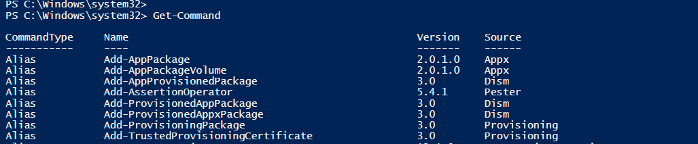
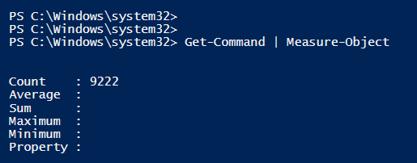

## Lets find A Command (Cmdlet)
If you open your IDE (ISE) and run the Command Get-Command This will give you all the CmdLet / Functions you have on your system.

```powershell
Get-Command
```


In my Computer I have install many modules so I have a lot of Commands.

