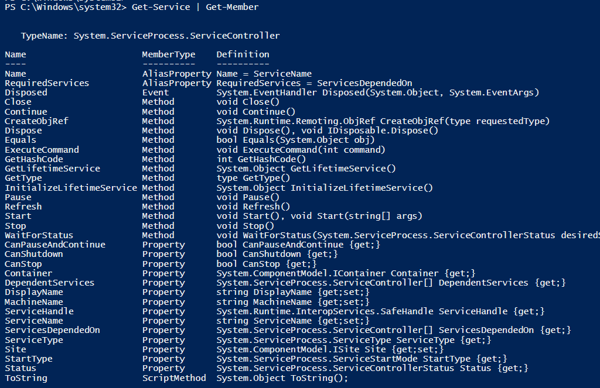

## Lets Explore A Command (Cmdlet)
After we found a commnd I need to understand how to work with the command, for that we have Get-Member.

In our example we use the Get-Service CmdLet.

```powershell
Get-Service | Get-Member
```


Lets explain this image:\
The first line says we using a command that returns an Object of type: **System.ServiceProcess.ServiceController.**\
This is a Dot net object so if we want we can open [MSDN](https://learn.microsoft.com/en-us/dotnet/api/system.serviceprocess.servicecontroller?view=dotnet-plat-ext-7.0) and read about it.

The Name column is the name of the property or the name of the method you can use.

The MemberType explains if this is a method or property.

The definition gets you the underline operation
* If a property of type bool etc...\
* If a property it read-only (only get;)\
* If the method needs a parameter etc...
