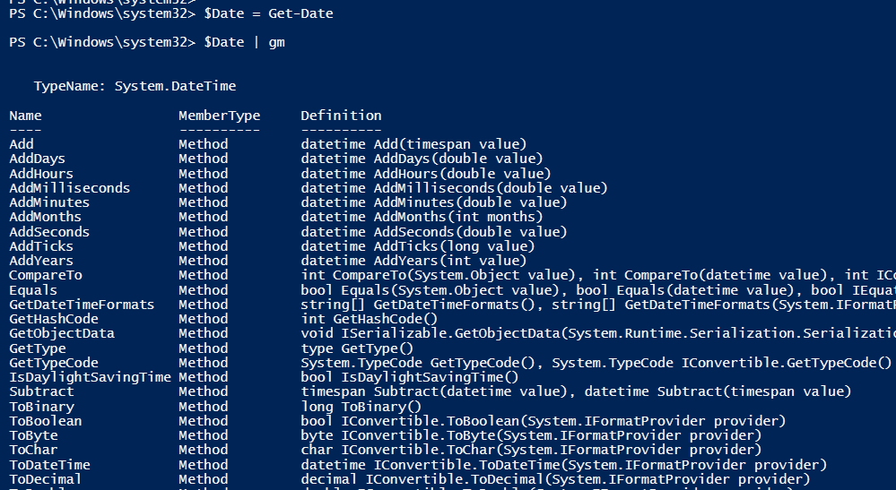
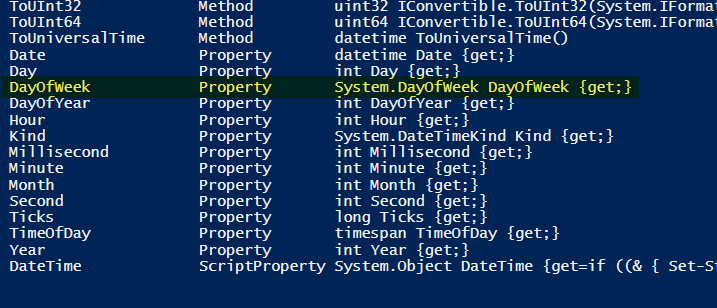

## What is a Variable
Variables are used to store information to be referenced and manipulated in a computer program. They also provide a way of labeling data with a descriptive name, so our programs can be understood more clearly by the reader and ourselves. It is helpful to think of variables as containers that hold information. Their sole purpose is to label and store data in memory. This data can then be used throughout your program.\
For more information about Powershell variable you should visit this page
[about_variables](https://learn.microsoft.com/en-us/powershell/module/microsoft.powershell.core/about/about_variables?view=powershell-7.3)

### Declare a Variable
In Powershell variable start with the $ sign and then string for the name of the variable.

```powershell
$Date = Get-Date
```
Now in the Date variable we have the content (object(s)) that come back from the CmdLet Get-Date


we can use the Get-Member (Alias gm) we learn in a prevues lesson to explore the object.\
As we can see we have a lots of methods, and if we scroll a lots of properties.


If we want to know the day of the week we can use

```powershell
$Date.DayOfWeek
```
In the $Date variable we have a DayOfWeek property.
